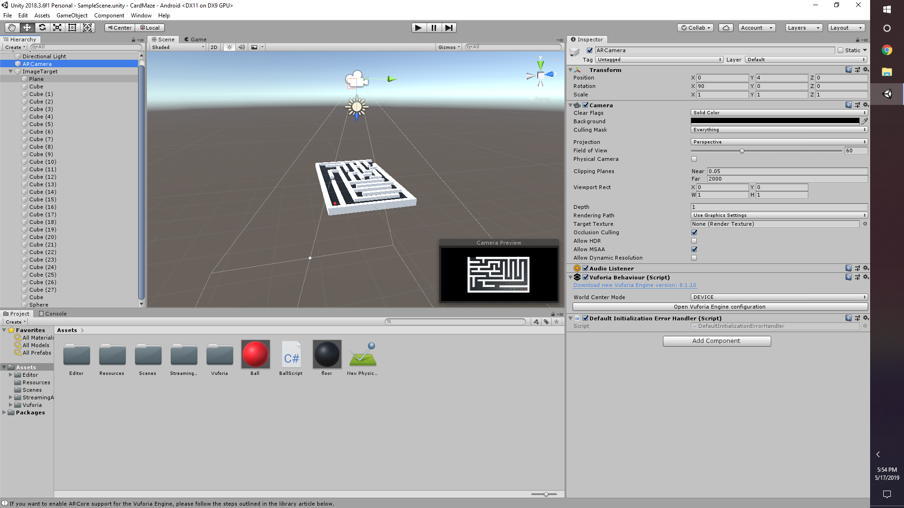
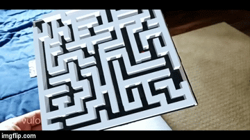

# Augmented-Reality-Business-Card

**First Implementation:** User is able to download my app and look at my business card that would allow them to access my resume, social media links, and videos.

**Link to Bug Demonstration:** https://www.youtube.com/watch?v=n-wUGrZC9qA

Problem is image stablization due to the attached img's not being on image plane, patch coming.

**Second Implementation:** Business card with a AR maze on the back of it plus additional games. This will allow the user to flip card over to have access to a corresponding game with resume. 

**Initial Game Prototype:** 

**Link to Full Demonstration:** https://www.youtube.com/watch?v=kWB9yAA-DY4
